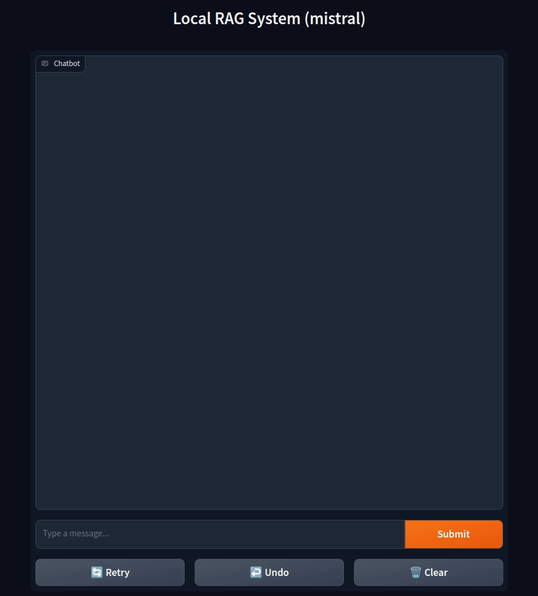

[](https://hpi.de/en/kisz/home.html)

# 

# Ask your documents!

## Implement a Retrieval Augmented Generation (RAG) system to query and retrieve information from your local documents efficiently.

## Hands-on Workshop.



## Gain practical experience with [embeddings](https://github.com/KISZ-BB/kisz-nlp-embeddings) , vector databases, and local Large Language Models (LLMs)


---

## Getting Started

#### Download or clone the repository

#### Create and activate a virtual environment

```shell
$ python3 -m venv myvenv
$ source myvenv/bin/activate
```

#### Install dependencies

```shell
$ pip3 install -r requirements.txt
```

#### Ollama

Install to run large language models locally.

```shell
$ curl https://ollama.ai/install.sh | sh
```

choose a model and download it. For example

```shell
$ ollama pull mistral
```

---

## Usage

```shell
(myvenv)$ python3 local-rag-gui.py
```

And open the exposed link with your browser for the Graphical User Interface version.

Or, run the following for the command line input version

```shell
(myvenv)$ python3 local-rag-cli.py
```

In case the LLM server is not running start it in a different terminal with:

```shell
$ ollama serve
```

#### Additional Input parameters on the Frontend

- Top k: Ranks the output tokens in descending order of probability, selects the first k tokens to create a new distribution, and it samples the output from it. Higher values result in more diverse answers, and lower values will produce more conservative answers. ([0, 10]. Default: 5)

- Top p: Works together with Top k, but instead of selecting a fixed number of tokens, it selects enough tokens to cover the given cumulative probability. A higher value will produce more varied text, and a lower value will lead to more focused and conservative answers. ([0.1, 1] Default: 0.9)

- Temp: This affects the “randomness” of the answers  by scaling the probability distribution of the output elements. Increasing the temperature will make the model answer more creatively. ([0.1, 1]. Default: 0.5)

---

## Development

Before commiting, format the code by using black as following on the project folder:

```shell
$ black -t py311 -S -l 99 .
```

You can Install Black with:

```shell
$ python3 -m pip install black
```

---

## License

[GPLv3](./LICENCE)
