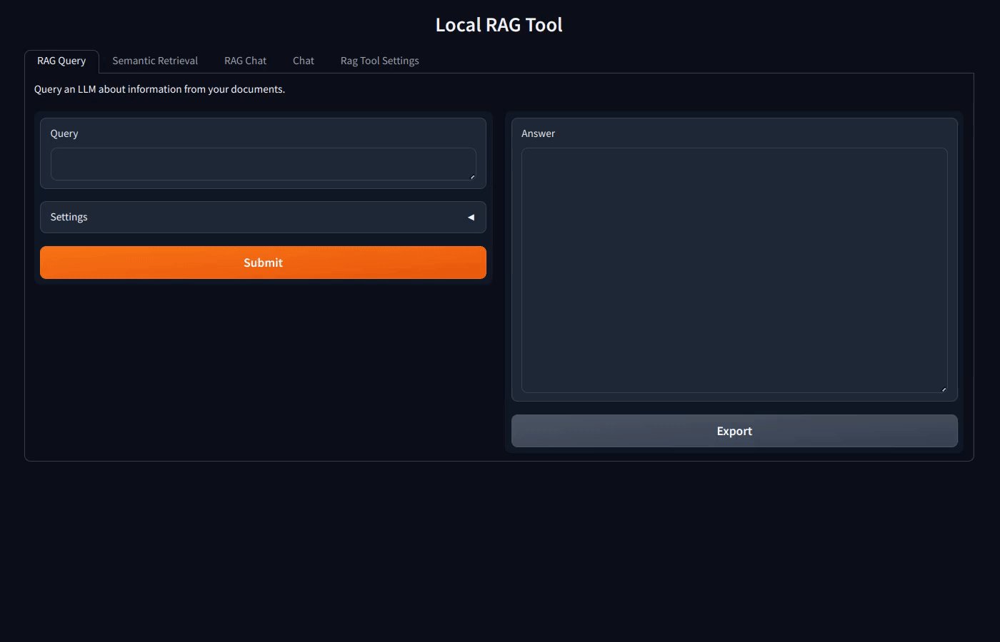

[](https://hpi.de/en/research/hpi-data-center/ai-service-center/)

# RAGSST

## Retrieval Augmented Generation and Semantic-search Tool

A quick start, locally-run tool to test and use as basis for various document-related use cases:

- Rag Query: Prompt a LLM that uses relevant context to answer your queries.
- Semantic Retrieval: Retrieve relevant passages from documents, showing sources and relevance.
- Rag Chat: Interact with a LLM that utilizes document retrieval and chat history.
- LLM Chat: Chat and test a local LLM, without document context.



The interface is divided into tabs for users to select and try the feature for the desired use case. 
The implementation is focused on simplicity, low-level components, and modularity, in order to depict the working principles and core elements, allowing developers and Python enthusiasts to modify and build upon.

Rag systems rely on sentence embeddings and vector databases. More information on embeddings can be found in our MOOC [Understanding Embeddings for Natural Language Processing](https://open.hpi.de/courses/embeddingsfornlp-kisz2023)

### Installation

Download or clone the repository.

On bash, you can run the following installation script:

```shell
$ bin/install.sh
```

---

**Alternatively, install it manually:**

#### Create and activate a virtual environment (optional)

```shell
$ python3 -m venv .myvenv
$ source .myvenv/bin/activate
```

#### Install dependencies

```shell
$ pip3 install -r requirements.txt
```

#### Ollama

Install it to run large language models locally

```shell
$ curl -fsSL https://ollama.ai/install.sh | sh
```

Or follow the installation instructions for your operating system: [Install Ollama](https://ollama.com/download)

Choose and download a LLM [model](https://ollama.com/library) [\*]

For example:

```shell
$ ollama pull llama3.2
```
---

### Usage

- Place your documents on the intended data folder (default: `data/`).
- Start the tool [†]

```shell
$ python3 app.py
```

- Open the provided URL on your web browser
- Enjoy


### Key Settings

#### Retrieval Parameters

- Relevance threshold: Sets the minimum similarity threshold for retrieved passages. Lower values result in more selective retrieval.

- Top n results: Specifies the maximum number of relevant passages to retrieve.

#### Additional Input parameters for the LLMs

- Top k: Ranks the output tokens in descending order of probability, selects the first k tokens to create a new distribution, and it samples the output from it. Higher values result in more diverse answers, and lower values will produce more conservative answers.

- Temp: This affects the “randomness” of the answers  by scaling the probability distribution of the output elements. Increasing the temperature will make the model answer more creatively.

- Top p: Works together with Top k, but instead of selecting a fixed number of tokens, it selects enough tokens to cover the given cumulative probability. A higher value will produce more varied text, and a lower value will lead to more focused and conservative answers.

---

[\*] Performance consideration: On notebooks/PCs with dedicated GPUs, models such as llama3.1, mistral or gemma2 should be able to run smoothly and rapidly. On a standard notebook, or if you encounter any memory of performance issues, prioritize smaller models such as llama3.2 or qwen2.5:3b.

[†] If you chose the installation with a virtual environment, remember to activate it before starting the application by running ```$ source .myvenv/bin/activate```

---

## Development

Before committing, format the code using Black:

```shell
$ black -t py311 -S -l 99 .
```

Linters:

- Pylance
- flake8 (args: --max-line-length=100 --extend-ignore=E401,E501,E741)


For more detailed logging, set the `LOG_LEVEL` environment variable:

```shell
$ export LOG_LEVEL='DEBUG'
```

## Author
- [Joaquin Gomez Prats](https://github.com/slovanos)

## License

[GPLv3](./LICENSE)
